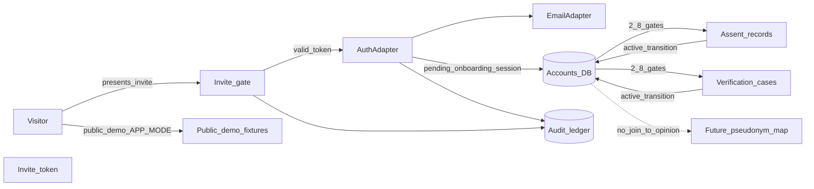

# Phase 2 architecture overview

**Status:** Work Package 2.2  
**ADRs:** [0002](./decisions/0002-environments-and-demo-isolation.md), [0003](./decisions/0003-postgresql-drizzle.md), [0004](./decisions/0004-authjs-invite-only.md), [0005](./decisions/0005-invite-gate-independent-of-auth.md)

## System / data-flow (gated mode)

## Identity vs consultation separation

| Store | Contents | Public API |
| --- | --- | --- |
| Account / identity | Contact channel, account state, roles, assent pointers, verification **status** | Never expose raw artifacts or recovery secrets |
| Institutional public | Decision records, approved audit summaries | No account IDs or contact channels |
| Future consultation | Conversation-scoped pseudonyms, opinion vectors | No reversible link in public/moderator APIs (2.10) |

Public opinion records must not require joins to legal identity. Pseudonym mapping (when built) is security-restricted and audited.

## Adapter boundary

Application features depend on TypeScript interfaces in `src/lib/adapters/`. Vendor SDKs are imported only inside adapter implementations introduced in later packages.

## Authorization

Server-enforced capabilities are defined in [capability-matrix.md](./capability-matrix.md). Account lifecycle, platform roles, and council seats are evaluated independently; Deliberation Council never implies Policy Council. Default deny. UI hiding is never the only control.
