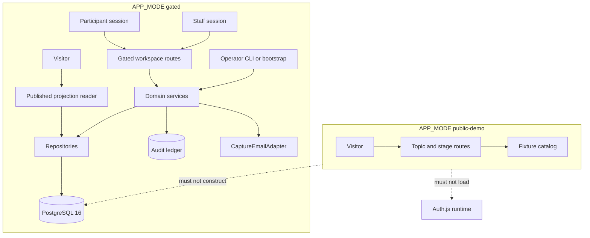

# Phase 3 architecture — operational alpha

**Status:** Work Package 3.1 contract as amended by 3.1.1 / ADR 0009 (design only — not implemented)  
**Plan:** [phase-3-plan.md](./phase-3-plan.md)  
**ADRs:** [0008](./decisions/0008-phase-3-operational-alpha-contract.md), [0009](./decisions/0009-phase-3-operational-slice-corrections.md)  
**Foundation:** [architecture-phase-2.md](./architecture-phase-2.md), ADRs 0002–0005, capability matrix, audit registry

This document proposes service boundaries, table groups, routes, and projections for Phase 3. It does **not** authorize migrations, routes, or vendor installs by itself. Implementing packages own those changes. A real off-device multi-user alpha requires an approved reachable gated deployment and persistent PostgreSQL; do not select a vendor here.

---

## 1. Public-demo versus gated request/data flows



| Concern | Public-demo | Gated alpha |
| --- | --- | --- |
| Topic pages | `fixtureCatalog` selectors | Published projection from DB only |
| Auth / DB | Refused (`assertEnvironmentSafe` / noop adapters) | Auth.js + Drizzle after safe assert |
| Mutations | None for real accounts | Capability-gated services |
| Email | N/A | Capture-only until vendor addendum |
| Alpha reset | N/A (fixtures in repo) | Wipes accounts + topic workflow tables |

**Invariant:** Server components, route handlers, and gated services/repositories must not import the synthetic fixture catalog for gated mutations.

---

## 2. Planned service and repository boundaries

Keep domain rules independent of React. Suggested modules (names indicative):

| Layer | Responsibility | Must not |
| --- | --- | --- |
| `src/domain/*` | Shared types/enums/schemas for topic/claim/evidence workflow | Import Next.js, DB clients, fixtures for writes |
| `src/lib/topics/*` services | Topic lifecycle transitions | Touch React; skip authz |
| `src/lib/claims/*`, `src/lib/evidence/*` | Submission workflow + quality axis | Fetch remote URLs |
| `src/lib/moderation/*` | Visibility transitions | Hard-delete history |
| `src/lib/conflicts/*` | Disclosure capture | Publish private detail |
| `src/lib/*/repository.ts` | SQL via Drizzle | Import `@/fixtures` |
| `src/app/workspace/**` | Gated UI (RSC + server actions/route handlers) | Authorize only in UI |
| `src/app/topics/**` | Public read; mode-branched data source | Leak staff fields |
| `src/lib/authz/*` | Capabilities | Infer participant from administrator |
| `src/lib/audit/*` | Registered events | Accept unregistered actions |

Adapter reuse from Phase 2: `PersistenceAdapter`, `AuthAdapter`, `EmailAdapter`, `AuditPublishAdapter`, `VerificationAdapter`. No new adapter vendors in the initial slice.

---

## 3. Proposed table groups and relationships (no migrations in 3.1)

Conceptual groups to add in **3.2** (names may adjust during migration design):

### 3.1 Core topic group

- `topics` — id, slug, title, question, background, scope, **`workflow_state`** (`draft` | `open_for_submissions` | `under_review` | `paused` | `archived`), **`publication_status`** (`unpublished` | `published`), timestamps, created_by_account_id, synthetic flag if any seed rows
- Operational workflow and publication status are independent; pause must not flip publication
- Optional `topic_changelog` or rely on revisions + audit

### 3.2 Claims and evidence

- `claims` — topic_id, author_account_id, title, summary, approach_label, workflow_state, moderation_visibility (`visible` | `held` | `hidden`), timestamps
- `evidence_sources` / `evidence_submissions` — topic_id, submitter_account_id, url, title, organization, author_type, source_type, limitations, workflow_state, quality_status, moderation_visibility (`visible` | `held` | `hidden`), timestamps
- `claim_evidence_links` — claim_id, evidence_id, relationship (`supporting` | `counterevidence`) — **basic link in 3.2/3.5**; richer comparison in 3.7

### 3.3 Disclosures

- `conflict_disclosures` — subject_type/id, account_id, public_summary, private_detail, created_at, updated_at

### 3.4 Revisions (enriched in 3.7)

- `content_revisions` — subject_type/id, revision_n, snapshot jsonb or normalized columns, edited_by_account_id, reason, created_at  
  Append-only from application permissions. Schema stubs may appear in 3.2; full history UX is 3.7.

### 3.5 Review artifacts

- Claim workflow reviews via `claims.review`; evidence workflow + quality via `evidence.review`
- Either columns on evidence/claims or review tables — reviewer_account_id, quality_status (evidence), workflow_decision, public_rationale, private_notes, created_at

### Relationships (logical)

```
accounts 1---* topics.created_by
topics 1---* claims
topics 1---* evidence_submissions
claims *---* evidence_submissions  (via claim_evidence_links)
claims/evidence 1---* conflict_disclosures
claims/evidence 1---* content_revisions
claims/evidence 1---* evidence_reviews
all mutable institutional actions ---> audit_events
```

**Non-joins for public APIs:** public projection queries must not require contact_channel, verification artifacts, or assent payloads.

---

## 4. Proposed public read projection

Allowlisted fields for gated anonymous/public topic reads when `publication_status = published`:

| Include | Exclude |
| --- | --- |
| Topic title, question, background, scope, published timestamps, operational workflow public label | Account IDs, contact channels |
| Claims/sources in workflow `accepted` (or explicitly publication-eligible) **and** visibility `visible` | Drafts, rejected-only bodies, held/hidden bodies |
| Evidence quality status + **public** rationale | Private moderation/review notes |
| Public conflict summaries (deepened after 3.8) | Private disclosure detail |
| Revision summaries safe for public (deepened in 3.7/3.10) | Invite tokens, verification cases |
| Allowlisted audit summaries (existing 2.9 projectors) | Raw privatePayload |

Projection builder lives in a pure module testable without React. **Minimal path wires in 3.6**; **3.10** completes and hardens.

---

## 5. Planned routes

### Gated workspace (authenticated)

| Route (planned) | Purpose | Capabilities |
| --- | --- | --- |
| `/workspace` | Alpha home / tasks | session |
| `/workspace/topics` | Staff/participant topic list | read scoped |
| `/workspace/topics/new` | Create topic | `topics.create` |
| `/workspace/topics/[slug]` | Edit/open/pause/archive; publish; staff tools | `topics.*` / review |
| `/workspace/topics/[slug]/submit` | Claim/evidence submit with basic relationship | `claims.submit`, `evidence.submit` |
| `/workspace/review` | Claim and evidence review queues | `claims.review`, `evidence.review` |
| `/workspace/moderation` | Visibility hold/hide/restore-to-visible | `moderation.review_submission` |
| `/staff/invitations` (or extend existing staff) | Issue invites | `invites.issue` |

Exact paths may align with existing `/account/*` and `/staff/*` trees; do not expose them on public-demo.

### Public routes

| Route | Public-demo | Gated |
| --- | --- | --- |
| `/topics`, `/topics/[slug]` | Fixtures (unchanged behavior) | Published projection only |
| `/topics/[slug]/consult` | Demonstration Public Input (fixture) | Remains out of Phase 3 operational scope; **Pol.is planned for Phase 4 of the alpha — not installed or called in Phase 3** |
| Agenda/deliberation/decision | Fixtures | Unchanged unless a later package explicitly says otherwise |

### Mutation / API boundaries

- Prefer server actions or App Router route handlers under `/api/...` that call services.
- Each mutation: CSRF → session → `authorizeCapability` → Zod → transaction → audit.
- Probe-style authz tests may extend `/api/authz/*` patterns from Phase 2.
- Public-demo: gated mutation endpoints return 404.

---

## 6. Transaction and concurrency expectations

| Operation | Transaction scope |
| --- | --- |
| Topic create | topic row + audit |
| Topic operational transition | `workflow_state` update + audit (+ optional changelog); **must not** alter `publication_status` unless the mutation is explicitly a publish/unpublish |
| Submit claim+evidence+disclosure | all inserts/links + audit; fail together |
| Resubmit after changes_requested | content update + workflow state + audit (+ revision row when 3.7 lands) |
| Claim workflow decision | `claims.review` + audit |
| Evidence workflow / quality decision | `evidence.review` + audit; must not rewrite unrelated popularity fields |
| Moderation visibility | visibility ∈ {visible,held,hidden} + audit; restore action → visible + `moderation.submission_restored`; never delete revisions |
| Invite issue | invitation row (hash) + audit; raw token only in response memory |
| Bootstrap admin | person/account/role (+ assurance seed if required) + audit |
| Publish | `publication_status` → published + projection stamp + audit (minimal in 3.6) |
| Alpha reset | documented ordered deletes/truncates in one operator procedure; audited |

**Concurrency:** use row-level conditions (update … where state = expected) or equivalent to prevent lost updates on workflow transitions; follow Phase 2 patterns used for invite claim / dual-control.

---

## 7. Audit event families (planned)

Register in implementing packages (unregistered actions must fail):

| Family | Examples |
| --- | --- |
| `operator.*` | `operator.bootstrap_administrator` |
| `invites.*` | `invites.issued`, `invites.revoked` |
| `topics.*` | `topics.created`, `topics.updated`, `topics.opened`, `topics.paused`, `topics.published`, `topics.archived`, `topics.reopened`, `topics.review_started` |
| `claims.*` | `claims.draft_created`, `claims.submitted`, `claims.changes_requested`, `claims.accepted`, `claims.rejected`, `claims.withdrawn`, `claims.revision_recorded` |
| `evidence.*` | parallel to claims + `evidence.quality_decided`, `evidence.quality_revised` |
| `conflicts.*` | `conflicts.disclosed`, `conflicts.updated` |
| `moderation.*` | `moderation.submission_held`, `moderation.submission_hidden`, `moderation.submission_restored` |
| `alpha.*` | `alpha.reset_executed` |

Public projectors must never echo contact channels, raw tokens, or private notes.

---

## 8. Reset strategy

Alpha-test interim council requires full reset of included alpha users and topic discussion ([ADR 0007](./decisions/0007-alpha-test-interim-council-dispositions.md)).

**Resettable:** accounts (non-retained), profiles, sessions, invitations, role assignments, verification cases as used in alpha, topics, claims, evidence, disclosures, revisions, moderation rows, conversation pseudonyms tied to alpha accounts, topic-related audit private payloads as specified by the reset runbook.

**Retained outputs:** product source, migrations, and the **post-alpha report** (OQ17)—not live alpha user/topic databases carried into production.

**Not a silent production migration:** restoring an alpha dump into a future production cluster as living membership/topic history is forbidden by contract.

Operator procedure lands in **3.12** (design may start earlier). Reset is gated-only, audited, and never exposed in public-demo.

---

## 9. First operational vertical slice (packages 3.2–3.6)

```mermaid
sequenceDiagram
  participant Op as Operator
  participant Admin as Administrator
  participant Part as Participant
  participant Rev as Reviewer
  participant DB as Gated DB

  Op->>DB: 3.3 bootstrap administrator
  Admin->>DB: 3.3 issue invitation hash
  Part->>DB: Phase 2 accept + onboard + activate
  Admin->>DB: 3.4 create draft topic + open
  Part->>DB: 3.5 submit claim URL relationship disclosure
  Rev->>DB: 3.6 claims.review / evidence.review / quality
  Admin->>DB: 3.6 topics.publish publication_status
  Note over DB: Visitor reads published projection; 3.10 hardens UI depth
```

**Slice done means:** staff can run topic open → submit → review → publish, and a visitor can see the minimal gated published projection—with durable schema, capabilities, and audits. **3.10** hardens presentation/revision/disclosure/moderation depth.

---

## 10. Authorization reminder

- Default deny; UI hide ≠ authorize.
- Administrator ≠ participant voter.
- Council seats ≠ platform roles.
- Active lifecycle + assurance ladder still wrap new capabilities.
- Alpha staff duty concentration in the project owner is allowed operationally; capability checks and actor audit remain mandatory ([ADR 0008](./decisions/0008-phase-3-operational-alpha-contract.md)).

---

## 11. Deferred by owner / later hardening register

Items below may be completed later **without** silently weakening core authorization, data integrity, environment isolation, auditability, or reset requirements. They are **not** complete.

| ID | Item | Notes |
| --- | --- | --- |
| D1 | Managed PostgreSQL host selection + DPA | Still blocked pending addendum; required for real off-device multi-user alpha once approved |
| D2 | Production email vendor (Resend/SES/etc.) | Capture-only + operator-delivered links until then |
| D3 | Dual-control for all moderation/publish actions | Phase 2 dual-control exists for holds/closure; broader use deferred |
| D4 | File uploads / object storage | Out of initial slice |
| D5 | Remote source fetch, preview, malware scan | Explicitly excluded; URLs stored only |
| D6 | Rich-text authoring dependencies | Plain text / Markdown-as-text TBD later without inventing legal HTML policy |
| D7 | Full-text search engine vendor | 3.11 may use SQL `ILIKE`/simple indexes first |
| D8 | Notifications (email/push) beyond invite/auth | Forbidden until designed |
| D9 | Pol.is-powered Public Input | **Planned Phase 4 alpha integration** — not installed or called in Phase 3; hosted vs self-hosted remains an open permitted-service decision |
| D10 | AI APIs, analytics, payments | Forbidden |
| D11 | Penetration test / formal security review | Before later pilot—not Phase 3 exit fiction |
| D12 | Manual NVDA sign-off on new workspace UI | Track in handoff |
| D13 | Distributed rate limiting | OQ14 carryover |
| D14 | Public attribution model for claim authors | See OQ18 |
| D15 | Post-alpha retention vs alpha wipe edge cases for assent/audit copies in reports | See OQ19 |
| D16 | Participant visibility into others’ in-flight submissions pre-publish | See OQ20 |

Completing a deferred item requires its own package or ADR touch; do not mark it done inside an unrelated package.

---

## 12. Future Pol.is integration boundary

**Public-facing name:** Public Input. When live, copy may say “Public Input, powered by Pol.is.” Pol.is results represent participant preferences, agreement, and disagreement. They do **not** determine factual truth, research quality, agenda qualification, or the institution’s recommendation.

**Phase 3.2 schema boundary (binding now):**

- Internal topic IDs remain the institutional source of truth.
- Future provider conversation IDs must live in a **separate mapping table**, not on `topics`, `claims`, or `evidence_submissions`.
- Provider-specific fields must **not** be added to topic/claim/evidence tables in 3.2.
- Conversation-scoped pseudonyms remain isolated from accounts.
- No public or moderator API may reverse-map opinion activity to contact details or legal identity.
- Imported Pol.is reports will be versioned aggregate snapshots.
- Pol.is outcomes must **never** update evidence-quality fields.
- The future Phase 4 package must define provider approval, authentication, retention, reset, export, outage, moderation, and audit behavior before install.

**Phase 2 registry caution:** The synthetic-only `closed_test_conversations` registry is **not** the production Pol.is registry and must **not** be relaxed or repurposed for live Pol.is.
